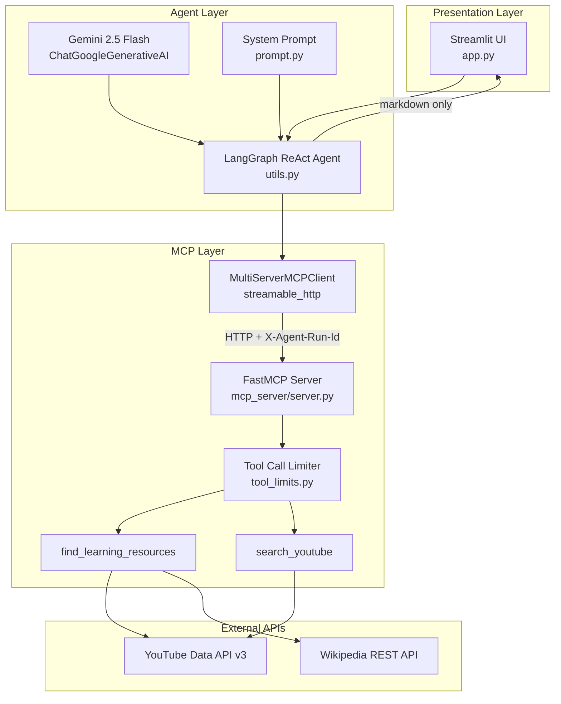
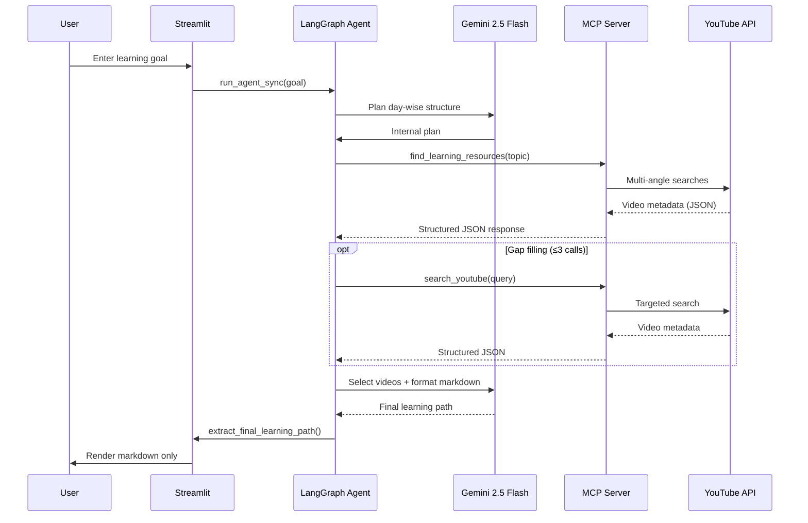

<div align="center">

# AI Learning Path Generator

### An agentic AI application that uses **LangGraph**, **Gemini 2.5 Flash**, and a **custom FastMCP server** to create personalized learning roadmaps with curated educational resources.

[](https://www.python.org/)
[](https://streamlit.io/)
[](https://langchain-ai.github.io/langgraph/)
[](https://aistudio.google.com/)
[](https://modelcontextprotocol.io/)
[](https://gofastmcp.com/)
[](LICENSE)

**[Live Demo](https://mcp-learningpath-generator.streamlit.app/)** · **[Repository](https://github.com/irfanhabeeb-002/MCP_Learning_path_generator)** · **[Report Bug](https://github.com/irfanhabeeb-002/MCP_Learning_path_generator/issues)**

</div>

---

## Project Overview

**AI Learning Path Generator** is a production-style **Python AI project** that turns a natural-language learning goal into a structured, day-wise study plan backed by real YouTube educational content. Instead of hard-coding API integrations inside the agent, the system exposes capabilities through a **Model Context Protocol (MCP) server** — a pattern increasingly used in **agentic AI** systems to separate reasoning from tool execution.

Users describe what they want to learn. A **LangGraph ReAct agent** powered by **Gemini 2.5 Flash** plans the curriculum, calls MCP tools to discover videos, and returns a polished markdown learning path. Credentials live in environment variables; the Streamlit UI collects only the learning goal.

> Built as a portfolio-grade demonstration of **AI workflow automation**, **MCP server design**, and **personalized learning roadmap** generation.

---

## Problem Statement

Creating a structured learning plan is time-consuming. Learners must:

- Break a broad goal into a logical daily sequence
- Find trustworthy, level-appropriate video content
- Avoid duplicate or low-quality resources
- Assemble everything into a readable format

Traditional approaches — manual curation, static course lists, or monolithic LLM prompts without tool access — produce inconsistent results, hallucinated URLs, or unstructured output. Hard-wiring YouTube and other APIs directly into the agent couples orchestration logic to external services and makes tools harder to reuse, test, or swap.

---

## Solution

This project decouples the **AI agent** from **external integrations** using MCP:

| Layer | Responsibility |
|-------|----------------|
| **Streamlit UI** | Collects the learning goal, shows progress, renders markdown output |
| **LangGraph ReAct Agent** | Plans days, selects tools, synthesizes the final learning path |
| **Gemini 2.5 Flash** | Reasoning and natural-language generation |
| **Custom FastMCP Server** | Exposes typed tools over Streamable HTTP |
| **YouTube Data API** | Authoritative video search and metadata |

The agent never invents video URLs. Tools return **structured JSON**; the model formats human-readable markdown for the user. **Server-side tool call limits** prevent runaway searches and protect API quota.

---

## Features

- **Personalized learning roadmaps** — Day-wise topics, objectives, and one recommended video per day
- **LangGraph ReAct agent** — Tool-augmented reasoning with controlled recursion (`recursion_limit=25`)
- **Gemini 2.5 Flash orchestration** — Fast, cost-effective planning and synthesis
- **Custom FastMCP server** — Self-hosted MCP tools over **Streamable HTTP** transport
- **YouTube Data API integration** — Education-biased search with structured video metadata
- **Broad resource discovery** — `find_learning_resources` aggregates multi-angle searches + Wikipedia summaries
- **Tool call limiting** — Enforced server-side: 1 × `find_learning_resources`, 3 × `search_youtube` per run
- **Clean response pipeline** — Extracts only the final AI markdown; no tool JSON in the UI
- **Environment-based configuration** — `GOOGLE_API_KEY`, `YOUTUBE_API_KEY`, `MCP_SERVER_URL` via `.env`
- **Real-time progress tracking** — Setup → Integration → Generation flow in Streamlit

---

## Screenshots

> Add screenshots to `docs/images/` and reference them here for the live portfolio presentation.

| Home | Learning Path Output |
|------|----------------------|
| _Streamlit goal input and progress bar_ | _Rendered markdown learning path with video links_ |

```markdown
<!-- Example once images are added:


-->
```

**[Try the live demo →](https://mcp-learningpath-generator.streamlit.app/)**

---

## Architecture Diagram

### High-level system view (ASCII)

```
┌─────────────────────────────────────────────────────────────────────────┐
│                         USER (Browser)                                  │
│                   Learning Goal + Generate Button                       │
└─────────────────────────────────┬───────────────────────────────────────┘
                                  │
                                  ▼
┌─────────────────────────────────────────────────────────────────────────┐
│                    STREAMLIT APP  (app.py)                              │
│   • Progress bar (Setup → Integration → Generation)                     │
│   • Markdown-only result rendering                                      │
│   • No credentials in UI — loads .env via utils                         │
└─────────────────────────────────┬───────────────────────────────────────┘
                                  │
                                  ▼
┌─────────────────────────────────────────────────────────────────────────┐
│                 LANGGRAPH REACT AGENT  (utils.py)                       │
│   • create_react_agent(Gemini 2.5 Flash, MCP tools)                     │
│   • extract_final_learning_path() — strips tool messages / JSON         │
│   • X-Agent-Run-Id header for per-run tool budgets                      │
└───────────────┬─────────────────────────────────────┬───────────────────┘
                │                                     │
                ▼                                     ▼
┌───────────────────────────┐       ┌───────────────────────────────────┐
│   GEMINI 2.5 FLASH        │       │   MultiServerMCPClient            │
│   Google AI Studio        │       │   transport: streamable_http      │
│   Planning + synthesis    │       │   url: MCP_SERVER_URL             │
└───────────────────────────┘       └─────────────────┬─────────────────┘
                                                      │
                                                      ▼
                                    ┌───────────────────────────────────┐
                                    │   FASTMCP SERVER  (mcp_server/)   │
                                    │   Streamable HTTP @ /mcp          │
                                    │  ┌─────────────────────────────┐  │
                                    │  │ find_learning_resources     │  │
                                    │  │ search_youtube              │  │
                                    │  │ tool_limits.py (enforced)   │  │
                                    │  └─────────────────────────────┘  │
                                    └─────────────────┬─────────────────┘
                                                      │
                              ┌───────────────────────┼───────────────────────┐
                              ▼                       ▼                       ▼
                    YouTube Data API v3        Wikipedia REST API         Structured JSON
                    (video search)             (reference links)          tool responses
```

### Component diagram (Mermaid)



---

## MCP Architecture

This project implements the **Model Context Protocol (MCP)** — an open standard for connecting AI applications to external tools and data sources. Rather than relying on third-party MCP hosts, the repository ships a **custom MCP server** built with **FastMCP**.

### Why a custom MCP server?

| Approach | Trade-off |
|----------|-----------|
| **Third-party MCP proxies** | Fast setup, but opaque tool catalogs, vendor lock-in, per-integration URLs |
| **Custom FastMCP server** | Full control over tools, schemas, rate limits, and deployment |

### Transport: Streamable HTTP

The MCP server exposes tools at:

```text
http://127.0.0.1:8001/mcp
```

The LangGraph app connects via `langchain-mcp-adapters` using `transport: "streamable_http"`, the same protocol family used by production MCP deployments. This enables:

- Network-separated agent and tool processes
- Multiple concurrent clients
- Standard HTTP infrastructure (load balancers, health checks, auth headers)

### MCP client configuration

```python
{
    "learning_path": {
        "url": "http://127.0.0.1:8001/mcp",
        "transport": "streamable_http",
        "headers": {"X-Agent-Run-Id": "<uuid-per-run>"},
    }
}
```

The `X-Agent-Run-Id` header ties tool invocations to a single learning-path generation run, enabling **server-side rate limiting**.

---

## Agent Workflow

The **LangGraph ReAct agent** follows a plan → act → observe → synthesize loop:



### Prompt-driven steps (agent instructions)

1. **Plan** — Derive days, topics, and objectives from the user goal
2. **Discover** — Call `find_learning_resources`, then `search_youtube` only if needed
3. **Select** — Choose one video per day from tool results (no invented URLs)
4. **Format** — Emit standardized markdown sections (Goal, Duration, Day N, Further Reading)
5. **Deliver** — Return the learning path as the final message only

---

## Technology Stack

| Category | Technology | Role |
|----------|------------|------|
| **Frontend** | [Streamlit](https://streamlit.io/) | Web UI, progress, markdown rendering |
| **Agent framework** | [LangGraph](https://langchain-ai.github.io/langgraph/) | ReAct agent graph (`create_react_agent`) |
| **LLM** | [Gemini 2.5 Flash](https://aistudio.google.com/) | Reasoning and content generation |
| **LLM SDK** | `langchain-google-genai` | Gemini integration |
| **MCP client** | `langchain-mcp-adapters` | `MultiServerMCPClient` |
| **MCP server** | [FastMCP](https://gofastmcp.com/) | Tool registration, Streamable HTTP |
| **Video data** | YouTube Data API v3 | Authoritative search and metadata |
| **Reference data** | Wikipedia REST API | Supplemental reading links |
| **Config** | `python-dotenv` | Environment variable loading |
| **Language** | Python 3.10+ | End-to-end implementation |

---

## Project Structure

```text
MCP_Learning_path_generator/
│
├── app.py                      # Streamlit frontend and progress UX
├── utils.py                    # Agent setup, MCP client, response extraction
├── prompt.py                   # Agent system prompt and output schema
├── requirements.txt            # Application dependencies
├── .env.example                # Environment variable template
│
└── mcp_server/
    ├── server.py               # FastMCP entrypoint (streamable-http)
    ├── tools.py                # search_youtube, find_learning_resources
    ├── tool_limits.py          # Per-run tool call enforcement
    └── requirements.txt        # MCP server dependencies
```

---

## Installation

### Prerequisites

- Python 3.10 or later
- [Google AI Studio API key](https://aistudio.google.com/) (Gemini)
- [YouTube Data API v3 key](https://console.cloud.google.com/) with YouTube Data API enabled

### 1. Clone the repository

```bash
git clone https://github.com/irfanhabeeb-002/MCP_Learning_path_generator.git
cd MCP_Learning_path_generator
```

### 2. Create a virtual environment

```bash
python3.11 -m venv venv
source venv/bin/activate        # macOS / Linux
# venv\Scripts\activate         # Windows
```

### 3. Install dependencies

```bash
pip install -r requirements.txt
pip install -r mcp_server/requirements.txt
```

---

## Configuration

Copy the environment template and add your credentials:

```bash
cp .env.example .env
```

Edit `.env` with your keys. **Never commit `.env` to version control.**

---

## Environment Variables

| Variable | Required | Default | Description |
|----------|----------|---------|-------------|
| `GOOGLE_API_KEY` | Yes | — | Google AI Studio key for Gemini 2.5 Flash |
| `YOUTUBE_API_KEY` | Yes | — | YouTube Data API v3 key (used by MCP server) |
| `MCP_SERVER_URL` | No | `http://127.0.0.1:8001/mcp` | MCP server endpoint for the agent |
| `MCP_HOST` | No | `127.0.0.1` | MCP server bind host |
| `MCP_PORT` | No | `8000` | MCP server bind port |
| `YOUTUBE_MAX_RESULTS` | No | `10` | Max videos per YouTube search (1–50) |
| `LOG_LEVEL` | No | `INFO` | MCP server log level |

---

## Running Locally

Two processes are required: the **MCP server** (tools) and the **Streamlit app** (UI + agent).

### Terminal 1 — MCP server

```bash
cd mcp_server
python server.py
```

Expected endpoint:

```text
http://127.0.0.1:8001/mcp
```

Set `MCP_PORT=8001` in `.env` or export it if you use a non-default port.

### Terminal 2 — Streamlit application

```bash
streamlit run app.py
```

Open **http://localhost:8501**, enter a learning goal, and click **Generate Learning Path**.

### Example goals

- *"I want to learn Python basics in 5 days"*
- *"Create a 7-day introduction to machine learning"*
- *"Help me learn React hooks in 3 days"*

---

## MCP Server Design

The custom **FastMCP server** is intentionally minimal: two focused tools instead of a sprawling third-party catalog. This keeps latency, quota usage, and agent confusion low.

### Design principles

1. **Structured JSON responses** — Every tool returns `{ success, tool, ... }` for reliable agent parsing
2. **Education-biased search** — YouTube queries prefer category 27 (Education) with safe-search enabled
3. **Server-side guardrails** — Tool limits enforced in `tool_limits.py`, not only in prompts
4. **Separation of concerns** — YouTube credentials stay on the MCP server; Gemini credentials stay in the agent layer
5. **Streamable HTTP** — Production-aligned transport for remote deployment

### Server startup

```python
mcp.run(
    transport="streamable-http",
    host="127.0.0.1",
    port=8001,
    path="/mcp",
)
```

---

## Tool Architecture

### `find_learning_resources(topic: str)` — max **1** call per run

Performs three angled YouTube searches (beginner, tutorial, advanced), deduplicates results, and optionally attaches a Wikipedia summary.

**Response shape (simplified):**

```json
{
  "success": true,
  "tool": "find_learning_resources",
  "topic": "python basics",
  "video_resources": {
    "getting_started": [...],
    "tutorials": [...],
    "deep_dives": [...]
  },
  "featured_videos": [...],
  "reference_links": [{ "title": "...", "url": "...", "type": "wikipedia" }],
  "suggested_focus_areas": ["Getting Started", "Tutorials"]
}
```

### `search_youtube(query: str)` — max **3** calls per run

Targeted YouTube Data API search for a specific day or topic gap.

**Response shape (simplified):**

```json
{
  "success": true,
  "tool": "search_youtube",
  "query": "python variables beginner tutorial",
  "result_count": 10,
  "videos": [
    {
      "video_id": "...",
      "title": "...",
      "channel_title": "...",
      "url": "https://www.youtube.com/watch?v=...",
      "description": "...",
      "thumbnail_url": "..."
    }
  ]
}
```

### Tool limit enforcement

```text
Agent run starts → UUID generated → sent as X-Agent-Run-Id
        │
        ▼
Each tool call → tool_limits.py increments counter
        │
        ├── Within limit → execute tool
        └── Exceeded     → return success: false with graceful message
```

---

## Learning Path Generation Flow

```text
 User Goal
     │
     ▼
┌─────────────┐
│ 1. PLAN     │  Agent derives N days, topics, objectives (no tools)
└──────┬──────┘
       ▼
┌─────────────┐
│ 2. DISCOVER │  find_learning_resources (1×) + search_youtube (0–3×)
└──────┬──────┘
       ▼
┌─────────────┐
│ 3. SELECT   │  One video per day from JSON tool results
└──────┬──────┘
       ▼
┌─────────────┐
│ 4. FORMAT   │  Markdown: Goal, Duration, Day 1…N, Further Reading
└──────┬──────┘
       ▼
┌─────────────┐
│ 5. DELIVER  │  extract_final_learning_path() → Streamlit markdown
└─────────────┘
```

**Output sections:** `# Title` · `## Goal` · `## Duration` · `## Day N` · `## Further Reading` · `## Recommended Channels`

---

## Why MCP Instead of Traditional APIs

| Traditional inline API calls | MCP-based architecture |
|------------------------------|------------------------|
| API logic embedded in agent code | Tools live in a dedicated MCP server |
| Hard to reuse across agents or IDEs | Standard protocol; tools consumable by any MCP client |
| Prompt-only rate discipline | Server-enforced tool call limits |
| Tight coupling to SDKs | Swap or extend tools without rewriting the agent |
| Opaque integration surface | Typed tools with JSON schemas and descriptions |

MCP is particularly valuable for **agentic AI** systems where the set of capabilities grows over time. This project demonstrates the pattern at a manageable scope: two well-defined tools, one HTTP endpoint, one LangGraph agent.

---

## Technical Highlights

- **LangGraph `create_react_agent`** with `recursion_limit=25` — enough for ~4 tool rounds without runaway loops
- **`extract_final_learning_path()`** — Reverse-walks message history; returns only the last AI markdown
- **`ConfigurationError`** — Fails fast when `.env` is incomplete; no silent partial setup
- **Per-run UUID correlation** — `X-Agent-Run-Id` header links agent session to MCP rate limits
- **Thread-safe in-memory limiter** — 30-minute TTL on run counters; suitable for single-instance deploys
- **No credentials in Streamlit UI** — Portfolio-ready security posture for demos and interviews

---

## Future Roadmap

- [ ] **Deploy MCP server** to cloud (Cloud Run, Fly.io, Railway) with HTTPS and API key auth
- [ ] **Playlist and export** — Generate YouTube playlists or downloadable PDF/Markdown exports
- [ ] **Persistent storage** — Save and revisit past learning paths (SQLite / Postgres)
- [ ] **Additional MCP tools** — Google Drive export, Notion pages, flashcard generation
- [ ] **Structured output mode** — Gemini JSON schema for stricter markdown validation
- [ ] **Redis-backed rate limits** — Multi-instance MCP server support
- [ ] **CI pipeline** — Lint, type-check, and integration tests against mocked YouTube responses
- [ ] **Screenshot gallery** — Add `docs/images/` for README and portfolio polish

---

## Lessons Learned

1. **Prompts alone do not control agent cost** — Server-side tool limits are essential for production behavior.
2. **MCP decoupling pays off early** — Even two tools benefit from a separate FastMCP process and Streamable HTTP transport.
3. **Response extraction matters** — ReAct agents emit tool messages and intermediate reasoning; the UI must filter to final markdown only.
4. **Structured JSON tool outputs** — Agents parse `{ success, videos, ... }` more reliably than raw API payloads.
5. **Environment-based config** — Removing API keys from the UI improves security and simplifies Streamlit Cloud deployment via secrets.

---

## Contributing

Contributions are welcome. Please open an issue or pull request on [GitHub](https://github.com/irfanhabeeb-002/MCP_Learning_path_generator).

1. Fork the repository
2. Create a feature branch (`git checkout -b feature/your-feature`)
3. Commit your changes
4. Push and open a Pull Request

---

## License

This project is licensed under the **MIT License**. See [LICENSE](LICENSE) for details.

---

<div align="center">

**Built with LangGraph · Gemini 2.5 Flash · FastMCP · Streamlit**

If this project helped you, consider giving it a ⭐ on [GitHub](https://github.com/irfanhabeeb-002/MCP_Learning_path_generator).

</div>
